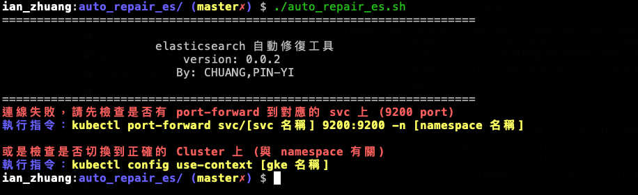
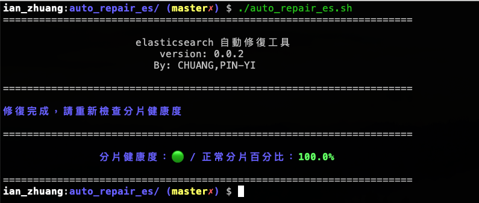

# auto_repair_es

## 說明

該腳本會依照錯誤訊息，自動修復 Elasticsearch 的問題。
目前還在測試階段，請勿用於正式環境。

<br>

## 安裝套件

此腳本會使用到 jq 指令，請先使用 brew 安裝。

```bash
brew install jq
```

## 使用方式

1. 請先切換到對應的 K8S Cluster 以及 Namespace

```bash
kubectl config use-context <cluster_name>
kubectl config set-context --current --namespace=<namespace_name>
```

<br>

2. 使用 port-forward 將 Elasticsearch 的 port 導到本機

```bash
kubectl port-forward svc/<svc 名稱> 9200:9200 -n <namespace 名稱>
```

<br>

3. 執行腳本

```bash
./auto_repair_es.sh
```

<br>

## 狀態說明

1. 若沒有切換到正確的 K8S Cluster 或 Namespace，會顯示以下錯誤訊息



<br>

2. 執行過程


<br>

3. 都修復成功的話，會顯示以下訊息



<br>

## 錯誤訊息參考資料

- [allocation temporarily throttled & reached the limit of incoming shard recoveries ](https://blog.csdn.net/qq_28345657/article/details/126707371)

- [cannot allocate because a previous copy of the primary shard existed but can no longer be found on the nodes in the cluster](https://www.coolcode.fun/archives/es-cai-keng-ji-lu-zhi-unassigned-fen-pian-wu-fa-hui-fu)

- [cannot allocate because all found copies of the shard are either stale or corrupt](https://blog.csdn.net/vincent_duan/article/details/107834582)
